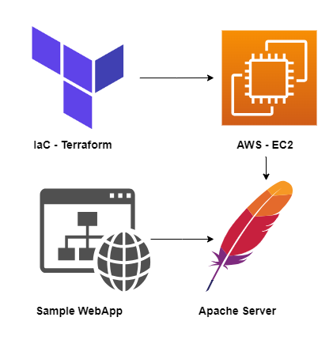

# Deployment of a Simple Static Website on an EC2 Instance using Terraform

### Overview
This project presents an efficient and automated approach to deploy a static website on an Amazon EC2 instance. Leveraging the power of Terraform, the infrastructure provisioning process, including EC2 instance creation and SSH key pair generation, is simplified and streamlined.

This project showcases the seamless deployment of a sample static website, eliminating the need for direct AWS console access. By running Terraform commands, users can effortlessly set up the required infrastructure, and the public IP of the EC2 instance is conveniently displayed for access. The project also provides instructions on securely accessing the EC2 instance via SSH.

### Prerequisites
- Install AWS CLI on your local machine.
- Configure AWS CLI with your access key and secret key using `aws configure`.
- Initialize Terraform configuration with `terraform init`.
- Deploy the infrastructure using the following commands: `terraform plan -out=tfplan` , `terraform apply -auto-approve tfplan`

Upon execution, the public IP of the EC2 instance will be displayed, and the private key will be stored as a `.pem` file in the project directory.

### SSH Access to EC2 Instance
- Modify the permissions for the `.pem` file:
- For Linux users: `chmod 400 key.pem`.
- For Windows users, follow the specified steps to assign necessary permissions.
    - Right-click on the .pem file -> Properties -> Security -> Advanced -> Disable inheritance -> Remove all Users.
    - Add -> Select a principal.
    - Enter your Windows username in "Enter the object name to select" -> OK.
    - Assign all permissions -> OK -> Apply.
- Connect to the EC2 instance via SSH: `ssh ubuntu@<public-ip> -i key.pem`

### Deployment Steps
- Update package information within the EC2 instance: `sudo apt-get update`
- Install Apache Tomcat server: `sudo apt-get install apache2`
- Clone the sample web application from the GitHub repository: `git clone https://github.com/mahesh042/demo-static-webpage.git`
- Copy the `index.html` file to the Apache server's web directory: `sudo cp demo-static-webpage/index.html /var/www/html/`

### Accessing the Deployed Application
Open your web browser and enter the EC2 instance's public IP address: `http://<public-ip>`. The sample static website will be successfully deployed and accessible for viewing.

This project offers an exemplary demonstration of deploying web applications on AWS EC2 instances using Terraform, streamlining the process and enabling users to focus on their core development tasks. The provided instructions empower users to effectively utilize this deployment architecture for their own projects with ease. Feel free to explore, customize, and deploy applications with confidence using this robust solution! 😊

